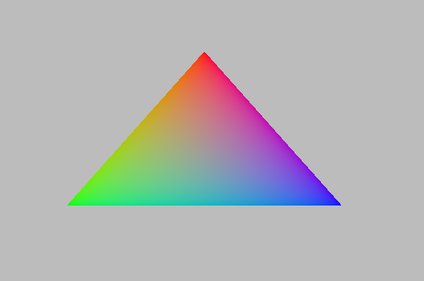

Getting started
===============

Set Up your project
-------------------
Along this tutorial, I will assume that you use CMake to set up your project.

Build source inside your project
^^^^^^^^^^^^^^^^^^^^^^^^^^^^^^^^
All you have to do is to copy the `Moutain-API` directory into your project directory then

.. code-block:: cmake

    add_subdirectory(Mountain-API)
    target_link_libraries(<your_target> PRIVATE Mountain::API

That's all you have to do to use Mountain-API

.. Use FindPackage
^^^^^^^^^^^^^

First triangle
-----------------
Let's start with the "Hello World" of 3D Graphics, and render a triangle.

Create Vulkan context and Window
^^^^^^^^^^^^^^^^^^^^^^^^^^^^^^^^
The first things to do, is to create a window and our Vulkan context.
For that we only hae to create a `moutain::Context` object, which can be done as
follow

.. code-block:: cpp

    #include "mountain/context.h"
    #include <vector>
    int main(){
            std::vector<const char*> const devices_extension{
                VK_KHR_SWAPCHAIN_EXTENSION_NAME
        };
        auto constexpr width = 1366;
        auto constexpr height = 768;
        mountain::Context const context{width,
                                        height,
                                        "First Triangle",
                                        devices_extension};
    }

